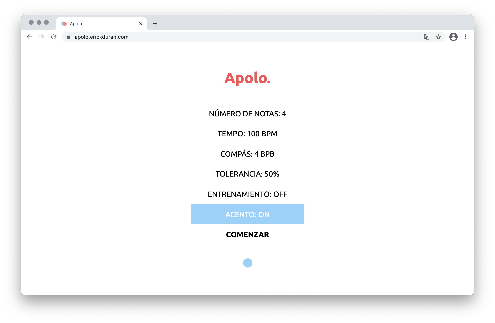

# Proyecto Apolo

> Este documento enlista las instrucciones de uso para [Apolo](https://apolo.erickduran.com).

## Tabla de contenido
- [Uso](#uso)
- [Detalles de parámetros](#detalles-de-parámetros)
- [Interpretación de resultados](#interpretación-de-resultados)
	- [Datos mostrados](#datos-mostrados)
	- [Consideraciones](#consideraciones)
- [Acerca de](#acerca-de)

## Uso

1. Ir a https://apolo.erickduran.com.

   

2. Navegar hacia abajo, probar el sonido y el micrófono.

   - Al hacer click en **Probar audio**, debe escuchar un sonido de metrónomo.

   

   - Al hacer click en **Probar micrófono**, se pedirá acceso al micrófono. Seleccionar la opción para permitirlo.

     

     Una barra animada aparecerá mostrando el nivel de sonido. Probar con algún sonido para verificar el funcionamiento. 

     

     Terminar la prueba haciendo click en el mismo botón de nuevo.

3. Regresar a arriba y modificar los parámetros deseados.

4. Hacer click en **Comenzar**. 

   - Se escuchará un compás de referencia dependiendo de los valores. 

   - Iniciar a tocar la secuencia **después** del compás de referencia. Éste se ve de color **gris**.

     

   - Cuando la secuencia se comienza a evaluar, el conteo cambiará a color **naranja**.

     

5. Al finalizar la evaluación, una gráfica aparecerá abajo indicando las intensidades y se mostrará el resultado de la evaluación. Verificar los resultados.

   

> Para evaluar otra secuencia, subir a arriba y repetir el proceso.

## Detalles de parámetros

- **Número de notas**: número de notas a evaluar.
- **Tempo**: velocidad el metrónomo en pulsaciones por minuto (*beats-per-minute*).
- **Compás**: subdivisiones en la secuencia a evaluar (*beats-per-bar*), debe ser menor que el número de notas a evaluar. Este valor también se utiliza para el compás de referencia antes de iniciar una evaluación.
- **Tolerancia**: margen de tolerancia en una predicción de Apolo. Las predicciones de Apolo se califican de 0 a 100, 100 siendo una secuencia homogénea. Si el margen de tolerancia es de 20%, todas las secuencias evaluadas con valores mayores a 80 se consideran homogéneas.
- **Entrenamiento** (deshabilitado): opción para agregar datos a la base de datos de Apolo (para administradores solamente).
- **Acento**: opción para acentuar el primer tiempo de cada compás en una secuencia.

## Interpretación de resultados

Cuando la evaluación termina, se muestra una gráfica junto con el resultado de la evaluación de Apolo:

### Datos mostrados

- El eje vertical muestra la intensidad.
- El eje horizontal denota el tiempo.
- Los puntos indicados como "valores utilizados" (signo `+`) son las intensidades que se utilizaron para hacer la evaluación. Estos son colocados en el punto aproximado en el que sonó el metrónomo (máximos locales).
- Al pie de la gráfica se muestra el resultado de la predicción de Apolo (homogénea o no homogénea).

### Consideraciones

- El resultado de la predicción es una estimación calculada a través de una red neuronal previamente entrenada mediante una base de datos.
- Es recomendable comparar la predicción y la gráfica para complementar los resultados.
- Es recomendable consultar los resultados con un instructor.
- La base de datos actual se encuentra en desarollo, los resultados de las predicciones irán mejorando mientras los datos aumenten.

## Acerca de
Este software fue creado y desarollado por Erick Durán bajo la licencia MIT. Copyright © 2020. Para cualquier duda o comentario enviar un correo a [me@erickduran.com](mailto:me@erickduran.com).
